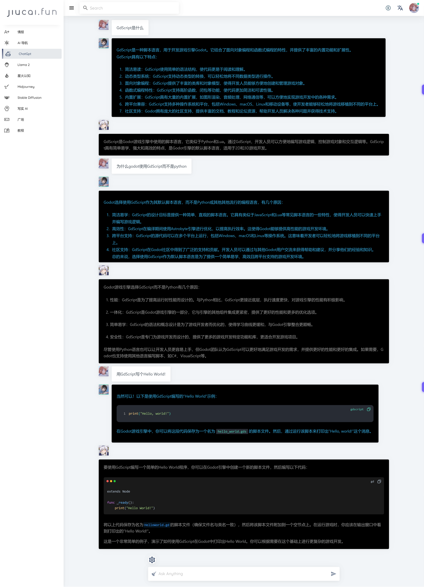

## GdScript是什么



-----------
> 问：GdScript是什么

```text
GdScript是一种脚本语言，用于开发游戏引擎Godot。它结合了面向对象编程和函数式编程的特性，并提供了丰富的内置功能和扩展性。
GdScript具有以下特点：
1. 简洁易读：GdScript使用简单的语法结构，使代码更易于阅读和理解。
2. 动态类型系统：GdScript支持动态类型的转换，可以轻松地将不同数据类型进行操作。
3. 面向对象编程：GdScript提供了丰富的类库和对象模型，使得开发人员能够方便地创建和管理游戏对象。
4. 函数式编程特性：GdScript支持高阶函数、闭包等功能，使代码更加简洁和可读性强。
5. 内置扩展：GdScript具有大量的内置扩展，如图形渲染、音频处理、网络通信等，可以方便地实现游戏开发中的各种需求。
6. 跨平台兼容：GdScript支持多种操作系统和平台，包括Windows、macOS、Linux和移动设备等，使开发者能够轻松地将游戏移植到不同的平台上。
7. 社区支持：Godot拥有庞大的社区支持，提供丰富的文档、教程和论坛资源，帮助开发人员解决各种问题并获得技术支持。
```

```text
GdScript是一种脚本语言，用于开发游戏引擎Godot。它结合了面向对象编程和函数式编程的特性，并提供了丰富的内置功能和扩展性。
GdScript具有以下特点：
1. 简洁易读：GdScript使用简单的语法结构，使代码更易于阅读和理解。
2. 动态类型系统：GdScript支持动态类型的转换，可以轻松地将不同数据类型进行操作。
3. 面向对象编程：GdScript提供了丰富的类库和对象模型，使得开发人员能够方便地创建和管理游戏对象。
4. 函数式编程特性：GdScript支持高阶函数、闭包等功能，使代码更加简洁和可读性强。
5. 内置扩展：GdScript具有大量的内置扩展，如图形渲染、音频处理、网络通信等，可以方便地实现游戏开发中的各种需求。
6. 跨平台兼容：GdScript支持多种操作系统和平台，包括Windows、macOS、Linux和移动设备等，使开发者能够轻松地将游戏移植到不同的平台上。
7. 社区支持：Godot拥有庞大的社区支持，提供丰富的文档、教程和论坛资源，帮助开发人员解决各种问题并获得技术支持。
```

-----------
> 问：为什么godot使用GdScript而不是python

```text
Godot选择使用GdScript作为其默认脚本语言，而不是Python或其他其他流行的编程语言，有几个原因：
1. 简洁易学：GdScript的设计目标是提供一种简单、直观的脚本语言。它具有类似于JavaScript和Lua等常见脚本语言的一些特性，使得开发人员可以快速上手并编写游戏逻辑。
2. 高效性：GdScript在编译期间使用Astrobyte引擎进行优化，以提高执行效率。这使得Godot能够提供高性能的游戏开发环境。
3. 跨平台支持：GdScript的源代码可以在多个平台上运行，包括Windows、macOS和Linux等操作系统。这意味着开发者可以轻松地将游戏移植到不同的平台上。
4. 社区支持：GdScript在Godot社区中得到了广泛的支持和贡献。开发人员可以通过与其他Godot用户交流来获得帮助和建议，并分享他们的经验和知识。
总的来说，选择使用GdScript作为默认脚本语言是为了提供一个简单易学、高效且跨平台支持的游戏开发环境。
```

```text
Godot游戏引擎选择GdScript而不是Python有几个原因：

1. 性能：GdScript是为了提高运行时性能而设计的。与Python相比，GdScript更接近底层，执行速度更快，对游戏引擎的性能有积极影响。

2. 一体化：GdScript是Godot游戏引擎的一部分，它与引擎的其他组件集成更紧密，提供了更好的性能和更多的优化选项。

3. 简单易学：GdScript的语法和概念设计是为了游戏开发者而优化的，使得学习曲线更缓和，与Godot引擎整合更顺畅。

4. 安全性：GdScript是专门为游戏开发而设计的，提供了更多的游戏开发特定功能和库，更适合开发游戏项目。

尽管使用Python语言也可以让开发人员更容易上手，但Godot团队认为GdScript可以更好地满足游戏开发的需求，并提供更好的性能和更好的集成。如果需要，Godot也支持使用其他语言编写脚本，如C#、VisualScript等。
```

-----------
> 问：用GdScript写个Hello World!


> 当然可以！以下是使用GdScript编写的“Hello World”示例：
> ```gdscript
> print("Hello, world!")
> ```
> 在Godot游戏引擎中，你可以将这段代码保存为一个名为`hello_world.gds`的脚本文件。然后，通过运行该脚本来打印出“Hello, world!”这个消息。


> ```gd
> extends Node
> 
> func _ready():
>     print("Hello World!")
> ```
> 这是一个简单的GdScript代码，用于在终端输出"Hello World!"。在Godot游戏引擎中，可以将这段代码附加到一个Node节点上，然后运行游戏，便会在控制台看到输出的"Hello World!"信息。祝您编程愉快！