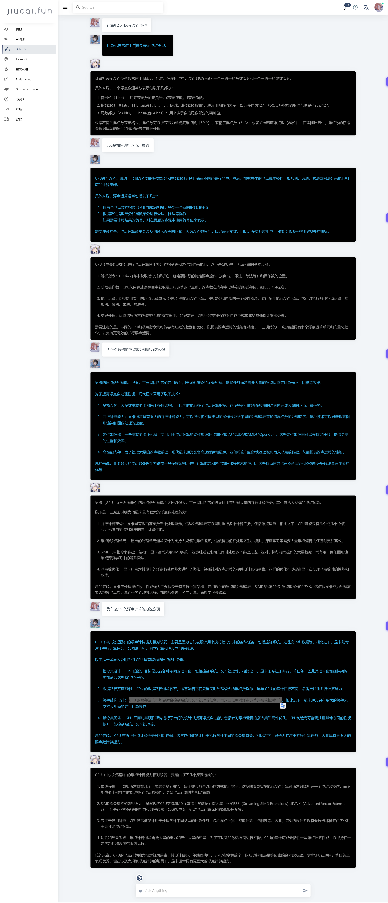

## GdScript类型之浮点


### 整数的范围



- 【PLC与计算机中常用数据类型：浮点数】 https://www.bilibili.com/video/BV12a4y1i7Ak/?share_source=copy_web&vd_source=5dbf211eec08e51a4c6d136972063c73


-----------
> 问：计算机如何表示浮点类型


> 计算机通常使用二进制表示浮点类型。


```text
计算机表示浮点类型通常使用IEEE 754标准。在该标准中，浮点数被存储为一个有符号的指数部分和一个有符号的尾数部分。

具体来说，一个浮点数通常被表示为以下几部分：
1. 符号位（1 bit）：用来表示数的正负号，0表示正数，1表示负数。
2. 指数部分（8 bits、11 bits或者15 bits）：用来表示指数部分的值，通常用偏移值表示，如偏移值为127，那么实际指数的取值范围是-126到127。
3. 尾数部分（23 bits、52 bits或者64 bits）：用来表示数的尾数部分的精确值。

根据不同的浮点数表示格式，浮点数可以被存储为单精度浮点数（32位）、双精度浮点数（64位）或者扩展精度浮点数（80位）。在实际计算中，浮点数的存储会根据具体的硬件和编程语言来进行处理。
```


-----------
> 问：cpu是如何进行浮点运算的


```text
CPU进行浮点运算时，会将浮点数的指数部分和尾数部分分别存储在不同的寄存器中。然后，根据具体的浮点算术操作（如加法、减法、乘法或除法）来执行相应的计算步骤。

具体来说，浮点运算通常包括以下几步：
1. 将两个浮点数的指数部分相加或者相减，得到一个新的指数部分值；
2. 根据新的指数部分和尾数部分进行乘法、除法等操作；
3. 如果需要计算结果的负号，则在最后的步骤中使用符号位来表示。

需要注意的是，浮点运算通常会涉及到舍入误差的问题，因为浮点数只能近似地表示实数。因此，在实际应用中，可能会出现一些精度损失的情况。
```


```text
CPU（中央处理器）进行浮点运算使用特定的指令集和硬件部件来执行。以下是CPU进行浮点运算的基本步骤：

1. 解析指令：CPU从内存中获取指令并解析它，确定要执行的特定浮点操作（如加法、乘法、除法等）和操作数的位置。

2. 获取操作数：CPU从内存或寄存器中获取要进行运算的浮点数。浮点数在内存中以特定的格式存储，如IEEE 754标准。

3. 执行运算：CPU使用专门的浮点运算单元（FPU）来执行浮点运算。FPU是CPU内部的一个硬件模块，专门负责执行浮点运算。它可以执行各种浮点运算，如加法、减法、乘法、除法等。

4. 结果处理：运算结果通常存储在FPU的寄存器中。如果需要，CPU会将结果保存到内存中或传递给其他指令继续处理。

需要注意的是，不同的CPU和浮点指令集可能会有细微的差别和优化，以提高浮点运算的性能和精度。一些现代的CPU还可能具有多个浮点运算单元和向量化指令，以支持更高效的并行浮点运算。
```


-----------
> 问：为什么显卡的浮点数处理能力这么强


```text
显卡的浮点数处理能力很强，主要是因为它们专门设计用于图形渲染和图像处理。这些任务通常需要大量的浮点运算来计算光照、阴影等效果。

为了提高浮点数处理性能，现代显卡采用了以下技术：

1. 多核架构：大多数高端显卡都采用多核架构，可以同时执行多个浮点运算指令。这使得它们能够在较短的时间内完成大量的浮点运算任务。

2. 并行计算能力：显卡通常具有强大的并行计算能力，可以通过将相同类型的操作分配给不同的处理单元来加速浮点数的处理速度。这种技术可以显著提高图形渲染和图像处理的速度。

3. 硬件加速器：一些高端显卡还配备了专门用于浮点运算的硬件加速器（如NVIDIA的CUDA或AMD的OpenCL），这些硬件加速器可以在特定任务上提供更高的性能和效率。

4. 高性能内存：为了处理大量的浮点数数据，现代显卡通常配备高速缓存和显存。这使得它们能够快速读取和写入浮点数数据，从而提高浮点运算的性能。

总的来说，显卡强大的浮点数处理能力得益于其多核架构、并行计算能力和硬件加速器等技术的应用。这些特点使显卡在图形渲染和图像处理等领域具有显著的优势。
```


```text
显卡（GPU，图形处理器）的浮点数处理能力之所以强大，主要是因为它们被设计用来处理大量的并行计算任务，其中包括大规模的浮点运算。

以下是一些原因说明为何显卡具有强大的浮点数处理能力：

1. 并行计算架构： 显卡具有数百甚至数千个处理单元，这些处理单元可以同时执行多个计算任务，包括浮点运算。相比之下，CPU可能只有几个或几十个核心，无法与显卡相媲美的并行计算性能。

2. 浮点数处理单元： 显卡的处理单元通常设计为支持大规模的浮点运算，这使得它们在处理图形、模拟、深度学习等需要大量浮点运算的任务时更加高效。

3. SIMD（单指令多数据）架构： 显卡通常采用SIMD架构，这意味着它们可以同时处理多个数据元素。这对于执行相同操作的大量数据非常有用，例如图形渲染或深度学习中的矩阵乘法。

4. 浮点数优化： 显卡厂商对其显卡的浮点数处理能力进行了优化，包括针对浮点运算的硬件设计和指令集。这样的优化可以提高显卡在处理浮点数时的性能和效率。

总的来说，显卡在处理浮点数上性能强大主要得益于其并行计算架构、专门设计的浮点数处理单元、SIMD架构和针对浮点数操作的优化。这使得显卡成为处理需要大规模浮点数运算的任务的理想选择，如图形处理、科学计算、深度学习等领域。
```